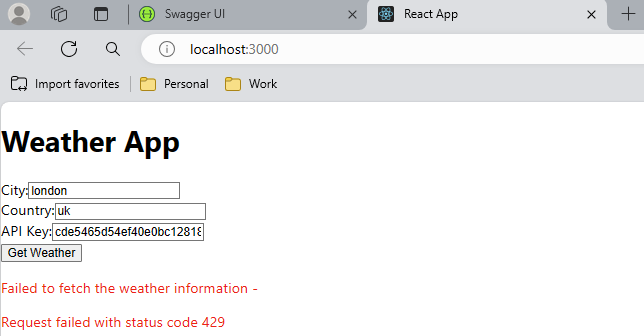

# Weather API

This project demonstrates how to create a simple Weather API using .NET Core. The API calls the OpenWeatherMap API to get the weather data for a specified city. The Weather API expects the latitude and longitude of the city as input and returns the weather data for that city. The Geolocation API is used to get the latitude and longitude of the city. 

The Weather API uses custom middlewares to validate the API key and to implement Rate Limiting. 
These requirements are usually implemented using cloud services like Azure API Management when the API is deployed to the cloud. Azure API Management provides features like API key validation, Rate Limiting, and caching out of the box.

The frontend application is a simple React application that calls the Weather API to get the weather data for a specified city and country.
The frontend application also provides input field to enter the API key. This should allow the user to test the API with different API keys to verify the working of the API key validation and Rate Limiting middlewares.

## Running the Application

1. Install .NET Core SDK from [here](https://dotnet.microsoft.com/en-us/download/dotnet/8.0).

2. Clone the repository to your local machine.

3. Navigate to the project directory.

4. Run the following command to restore the packages:

```` cli
dotnet restore
````

5. Run the following command to build the project:

```` cli
dotnet build
````

6. Run the following command to start the project:

```` cli
dotnet run --project src\backend\OpenWeatherApp.API\OpenWeatherApp.API.csproj
````

7. Run the following command to start the frontend application:

```` cli
cd src\frontend\weather-app
npm install
npm start
````

## Testing the Weather Application

After starting the frontend and backend applications, you can test the Weather API using the frontend application.

1. Enter the city and country for which you want to get the weather data. 
2. Enter the API key in the input field.  The API keys are listed in the `appsettings.json` file. If you don't pass the API key, the API will return a `401 Unauthorized` response. The application uses middleware to validate the API key. For simplicity, the API key is hardcoded in the `appsettings.json` file. In a production environment, the API key should be stored in a secure location like Azure Key Vault.
3. Click the `Get Weather` button. The frontend application will call the Weather API and display the weather data for the specified city. The weather API will internally call the OpenWeatherMap API to get the weather data for the specified city. The Weather API will return only the `Description` field from the OpenWeatherMap API response.

```` json
{
    "coord": {
        "lon": 4.8897,
        "lat": 52.374
    },
    "weather": [
        {
            "id": 803,
            "main": "Clouds",
            "description": "broken clouds",
            "icon": "04d"
        }
    ],
    "base": "stations",
    "main": {
        "temp": 282.15,
        "feels_like": 278.92,
        "temp_min": 281.48,
        "temp_max": 282.59,
        "pressure": 1022,
        "humidity": 87
    },
    "visibility": 10000,
    "wind": {
        "speed": 3.09,
        "deg": 240
    },
    "clouds": {
        "all": 75
    },
    "dt": 1619780400,
    "sys": {
        "type": 1,
        "id": 1524,
        "country": "NL",
        "sunrise": 1619766826,
        "sunset": 1619820343
    },
    "timezone": 7200,
    "id": 2759794,
    "name": "Amsterdam",
    "cod": 200
}
````

Here is a screenshot of the frontend application with a successful response from the Weather API:

4. The API also uses Rate Limiting as per the requirements. If the number of requests exceeds the limit, the API will return a `429 Too Many Requests` response. You can test this by sending more than the maximum number of requests in a hour which is 5.

The Rate limiting is implemented using a custom middleware. The middleware checks the number of requests made by the client in the last hour and if the number of requests exceeds the limit, it will return a `429 Too Many Requests` response. The number of requests is stored in the cache and the cache is cleared every hour. An in-memory cache is used for this purpose. In a production environment, a distributed cache like Redis should be used.




You can also test the Weather API using `curl` or any other API testing tool like Postman.
Follow the steps below to test the Weather API using `curl`:

1. Open your terminal.

2. Use the following `curl` command to call the Weather API. Replace `your-api-key` with actual API key and `city,country` with the city and country for which you want to get the weather data. The API keys are listed in the `appsettings.json` file.

```` cli
curl GET "http://localhost:5150/weather?q=city,country&appid=your-api-key"
````


## Running the Unit Tests

The unit tests are written using MSTest. The depencencies are mocked using Moq.
To run the tests, navigate to the test project directory and use the following command:

```` cli
dotnet test
````
    